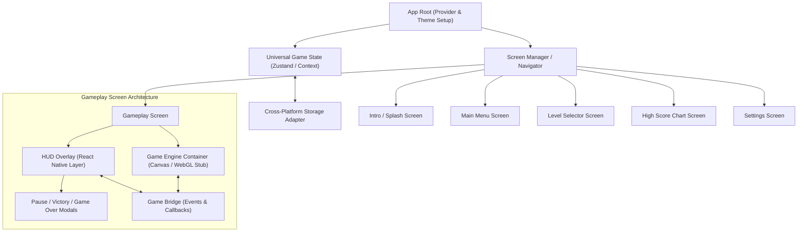

# Cross-Platform React Native Game Boilerplate Plan

This plan establishes a modular, multiplatform boilerplate for **Web and Mobile (iOS & Android)** using **React Native (Expo)**. It focuses on screen management, UI overlays (HUD), and maximum code reuse while decoupling the React UI layer from the underlying game engine to be plugged in later.

---

## Architecture Overview

---

## User Review Required

> [!IMPORTANT]
> **Tooling & Framework Selection**:
> We recommend **Expo (Managed Workflow with TypeScript)** as the foundation. Expo provides seamless single-codebase builds across Web, iOS, and Android with zero-config Webpack/Metro bundling, responsive screen support, asset handling, and cross-platform storage.

> [!NOTE]
> **Game Engine Decoupling**:
> To ensure maximum flexibility for whatever game engine you choose (Canvas 2D, PixiJS, Phaser, Three.js, or custom WebGL), the Gameplay Screen will use a generic **Engine Bridge** pattern:
> - The Game Canvas runs in its container (DOM canvas on web / WebView, Canvas, or GLView on mobile).
> - The React Native HUD floats on top as an overlay and communicates via clean bidirectional events (`onScoreUpdate`, `onGameOver`, `pauseGame()`, `resumeGame()`).

---

## Proposed Changes

### 1. Project Initialization & Foundation Setup

Initialize the universal React Native / Expo environment configured for TypeScript and cross-platform web support.

#### [NEW] [package.json](file:///Users/isegura/Documents/CODE/bouncerback%202/package.json)
- Setup Expo dependencies (`expo`, `react-native`, `react-native-web`, `react-dom`, `@expo/metro-runtime`).
- UI & styling primitives (`react-native-safe-area-context`, `lucide-react-native` or icon set).
- Universal state management (`zustand`) and storage (`@react-native-async-storage/async-storage`).

#### [NEW] [app.json](file:///Users/isegura/Documents/CODE/bouncerback%202/app.json) & [tsconfig.json](file:///Users/isegura/Documents/CODE/bouncerback%202/tsconfig.json)
- Configure cross-platform settings, orientation (landscape or portrait locks/defaults), web viewport settings, and path aliases (e.g. `@/components`, `@/screens`, `@/state`).

---

### 2. Core Theme & Design System

A shared retro/arcade aesthetic system ensuring high visual polish and consistent UI components across all platforms.

#### [NEW] `src/theme/colors.ts` & `src/theme/typography.ts`
- Unified color palette (dark theme with vibrant neon/arcade accents, glassmorphic cards, glowing borders).
- Font presets and typography scales adaptable across web resolutions and mobile screens.

#### [NEW] `src/components/common/`
- `GameButton.tsx`: Pressable retro button with sound trigger, active bounce animations, and hover/focus states for web.
- `GameCard.tsx`: Glassmorphic container for dialogs, scoreboards, and level tiles.
- `ResponsiveContainer.tsx`: Handles safe area insets on mobile and aspect-ratio letterboxing / auto-scaling on web.
- `ModalBackdrop.tsx`: Universal blur/dim overlay for popups and pause menus.

---

### 3. State Management & Persistence

Universal state layer that handles game progression, settings, and high scores independently of the platform.

#### [NEW] `src/state/gameStore.ts`
- Current active screen state (`'intro' | 'main_menu' | 'level_select' | 'high_scores' | 'settings' | 'gameplay'`).
- Selected level, player lives, current score, high scores list.
- Sound & music toggles, volume controls.

#### [NEW] `src/services/storage.ts`
- Local persistence wrapper for saving unlocked levels, star ratings, and leaderboard data across app restarts.

---

### 4. Screen Implementations

#### [NEW] `src/screens/IntroScreen.tsx`
- Animated game title / logo.
- Blinking "Press Start / Tap Anywhere" prompt.
- Auto-transition or tap listener leading to the Main Menu.

#### [NEW] `src/screens/MainMenuScreen.tsx`
- Navigation action list: **Play (Continue)**, **Level Select**, **High Scores**, **Settings**, **Credits**.
- Sound and music quick-toggle icons.
- Version badge and animated background effects.

#### [NEW] `src/screens/LevelSelectScreen.tsx`
- Scrollable grid of levels displaying level numbers, unlocked/locked status, and 3-star ratings.
- "Back to Menu" button and "Play Selected" action.

#### [NEW] `src/screens/HighScoreScreen.tsx`
- Arcade leaderboard table ranking top scores, dates, and level tags.
- Option to clear scores or filter by level/difficulty.

#### [NEW] `src/screens/SettingsScreen.tsx`
- Audio sliders (SFX & BGM), controls scheme selector (touch/keyboard/gamepad indicators), and reset progress option.

---

### 5. Gameplay Screen & HUD Overlay Architecture

#### [NEW] `src/screens/GameplayScreen.tsx`
- **Engine Viewport Component**: Placeholder container ready to host the future game engine (Canvas / WebGL).
- **HUD Overlay**:
  - Top Bar: Current Score, Multiplier, Health/Lives icons, Timer, Level title.
  - Controls: Pause button (top right), optional on-screen touch controls if needed.
- **Overlaid Modals**:
  - `PauseMenuModal.tsx`: Resume, Restart Level, Settings, Quit to Menu.
  - `GameOverModal.tsx`: Final score, high score indicator, Retry button, Menu button.
  - `LevelCompleteModal.tsx`: Score breakdown, star rating calculation, Next Level button.

#### [NEW] `src/game/bridge.ts`
- TypeScript contract (`GameBridgeInterface`) defining how the game engine and React UI communicate:
  - Events emitted by UI to Game: `pause()`, `resume()`, `restart()`, `setAudioMuted(boolean)`.
  - Events emitted by Game to UI: `onScore(points)`, `onHealthChange(lives)`, `onLevelComplete(stats)`, `onGameOver()`.

---

## Verification Plan

### Automated Checks
- Run TypeScript type checks (`npx tsc --noEmit`) to ensure complete type safety across all screens and bridge interfaces.
- Run linting / build tests (`npm run build` or `npx expo export --platform web`).

### Manual Cross-Platform Verification
1. **Web Testing**:
   - Launch local web dev server (`npx expo start --web`).
   - Verify all screen transitions (Intro -> Main Menu -> Level Select -> Gameplay -> High Scores).
   - Test responsive window resizing (mobile viewport vs desktop widescreen).
   - Test HUD pause/resume/game-over modal triggers in the gameplay screen.
2. **Mobile (Native) Testing**:
   - Verify layout with notch/island safe areas using Expo Go / simulator.
   - Verify touch feedback and layout responsiveness.
